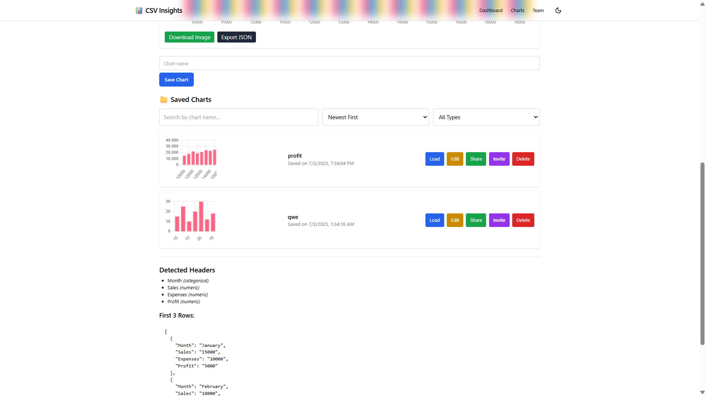

# 📊 CSV Analytics Dashboard

A modern, full-stack web application that empowers you to effortlessly upload, visualize, and share your CSV data through interactive charts. Built with a robust stack including **React**, **Node.js**, **MongoDB**, and **Chart.js**, this dashboard goes beyond basic visualization, offering comprehensive features like secure **authentication**, **public sharing**, and powerful **team collaboration** with **role-based access control (RBAC)**.

---

## 🚀 Key Features

This dashboard is packed with features to streamline your data analysis:

* ✅ **Intuitive CSV Upload**: Simply drag and drop your CSV files for smart parsing and instant data preparation.
* ✅ **Dynamic Chart Rendering**: Visualize your data with a variety of interactive chart types, including **Bar**, **Line**, **Pie**, and **Scatter** charts.
* ✅ **Multi-Series Chart Support**: Display complex datasets by integrating multiple data series into a single chart.
* ✅ **Secure Chart Management**: Authenticated users can easily **save and load** their customized charts for future access and analysis.
* ✅ **Effortless Public Sharing**: Generate **read-only public links** to share your insights with anyone, anywhere.
* ✅ **Seamless Team Collaboration**: Invite team members with specific roles (viewer/editor) to collaborate on dashboards.
* ✅ **Robust Role-Based Access Control (RBAC)**: Fine-tune permissions to ensure data security and controlled access within your team(comming soon).
* ✅ **Sleek & Responsive UI**: Enjoy a clean, modern user interface built with **Tailwind CSS** that adapts beautifully to any device.

---

## 🧱 Tech Stack

This project leverages a powerful and modern technology stack to deliver a seamless experience:

| Category         | Technologies                                 |
| :--------------- | :------------------------------------------- |
| **Frontend** | React + Vite, Tailwind CSS, Zustand (state management) |
| **Backend** | Node.js + Express, RESTful APIs              |
| **Database** | MongoDB, Mongoose (ODM)                      |
| **Charts** | Chart.js, react-chartjs-2                    |
| **Authentication** | JWT (JSON Web Tokens), bcrypt                |
| **Real-Time** | Socket.IO 🔜                   |

---

## 📁 Project Structure

Understanding the project's layout will help you navigate and contribute: 

```
csv-analytics-dashboard/
├── frontend/             # React app (Vite + Tailwind)
│   ├── components/       # Reusable UI components (Uploader, ChartRenderer, etc.)
│   ├── pages/            # Main application pages (Dashboard, PublicChart)
│   ├── store/            # Zustand for efficient global state management
│   ├── utils/            # Utility functions (CSV parser, chart helpers)
│   └── main.jsx          # Frontend application entry point
│
├── backend/              # Express server (Node.js + MongoDB)
│   ├── models/           # Mongoose schemas (Chart, Invite, User)
│   ├── routes/           # Express API routes (auth, charts, invites)
│   ├── controllers/      # Business logic for handling API requests
│   ├── middleware/       # Authentication middleware (JWT verification)
│   └── server.js         # Backend server entry point
│
├── .gitignore            # Specifies intentionally untracked files to ignore
└── README.md             # This README file
```
---

## 🔐 Role-Based Collaboration

Empower your team with flexible access levels:

* **Owner**: Has full administrative control, including editing, deleting charts, and inviting new members.
* **Editor**: Can modify chart configurations and data.
* **Viewer**: Has view-only access to charts.

Invitations for collaboration can be conveniently sent via email and accepted directly through the dashboard, simplifying team onboarding.

---

## 📷 Screenshots

Get a glimpse of the CSV Analytics Dashboard in action:

### 📊 Dashboard with Chart Preview



### ✏️ Edit Graph Flow


### 💾 Saved Graph Flow


### 📩 Invite Collaboration Flow


---

## 🚀 Getting Started

Follow these steps to get the CSV Analytics Dashboard up and running on your local machine.

### 📦 Prerequisites

Before you begin, ensure you have the following installed:

* **Node.js** and **npm** (or yarn)
* **MongoDB** (either a local instance or a cloud-hosted service like MongoDB Atlas)
* **Git**

### ⚙️ Clone the Repository

Start by cloning the project repository to your local machine:

```bash
git clone https://github.com/AashayPatel/csv-analytics-dashboard.git
cd csv-analytics-dashboard
```
Once cloned, you'll need to set up both the frontend and backend. Further instructions for installation and running the application will be provided in separate frontend/README.md and backend/README.md files (it's a good idea to add these if they don't exist yet, to keep the main README concise).

Made with ❤️ by [Aashay Patel](https://github.com/AashayPatel)
